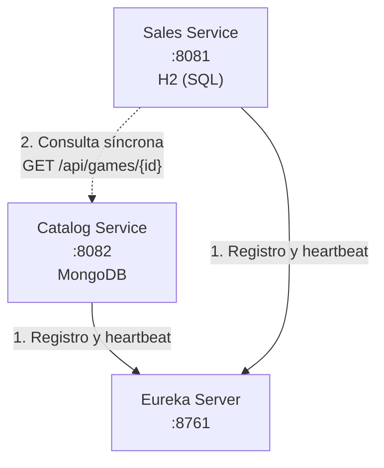
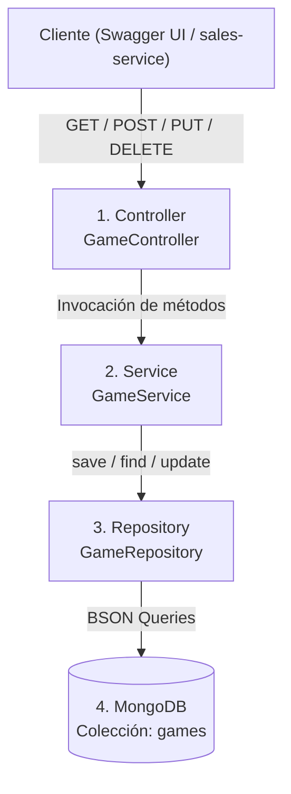
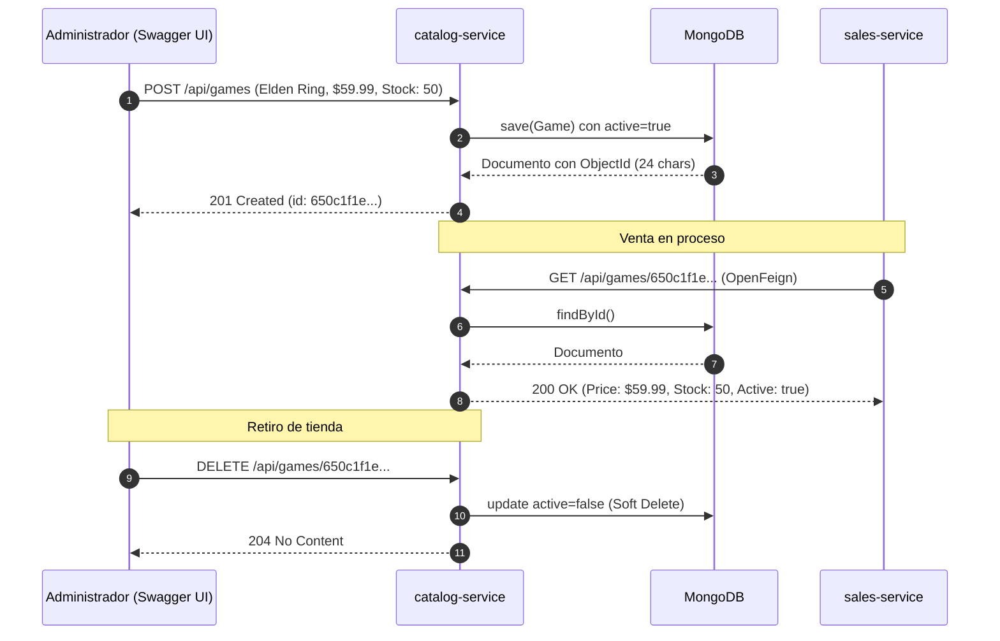
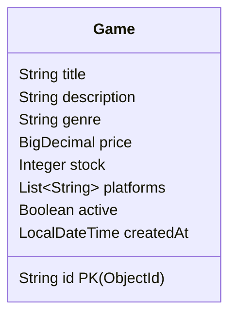

# Catalog Service

> Microservicio de **catálogo de videojuegos, inventario NoSQL y gestión de precios oficiales**, construido sobre una arquitectura de microservicios con Spring Cloud, MongoDB y documentado interactivamente con Swagger / OpenAPI 3.


---

## Tabla de contenido

1. [Resumen del proyecto](#1-resumen-del-proyecto)
2. [Stack tecnológico y por qué se eligió](#2-stack-tecnológico-y-por-qué-se-eligió)
3. [Ecosistema de microservicios](#3-ecosistema-de-microservicios)
4. [Decisiones de arquitectura](#4-decisiones-de-arquitectura)
5. [Arquitectura interna por capas](#5-arquitectura-interna-por-capas)
6. [Flujo del ciclo de vida de un videojuego](#6-flujo-del-ciclo-de-vida-de-un-videojuego)
7. [Estructura del proyecto](#7-estructura-del-proyecto)
8. [Modelo de datos NoSQL](#8-modelo-de-datos-nosql)
9. [Referencia de la API y Swagger UI](#9-referencia-de-la-api-y-swagger-ui)
10. [Manejo de errores](#10-manejo-de-errores)
11. [Configuración](#11-configuración)
12. [Instalación y ejecución](#12-instalación-y-ejecución)
13. [Guía de pruebas](#13-guía-de-pruebas)
14. [Solución de problemas](#14-solución-de-problemas)
15. [Mejoras futuras](#15-mejoras-futuras)

---

## 1. Resumen del proyecto

`catalog-service` es la **fuente única de la verdad** para todo lo relacionado con los productos de la tienda de videojuegos:

| Responsabilidad | Descripción |
|---|---|
| Administración de catálogo | Alta, edición, consulta y borrado lógico de videojuegos. |
| Control de inventario | Gestión del stock disponible en almacén para cada título. |
| Precios oficiales | Custodia el precio unitario real que valida `sales-service` para evitar fraudes. |
| Documentación interactiva | Expone interfaz visual Swagger UI para probar endpoints desde el navegador. |
| Clasificación y búsqueda | Filtros por género (RPG, Acción, etc.) y consulta de juegos activos. |
| Integridad histórica (Soft Delete) | Desactiva juegos sin destruirlos físicamente, preservando el histórico de compras. |

**¿Por qué existe como servicio independiente?** El catálogo es un servicio con alta frecuencia de lectura y baja frecuencia de escritura que no debe colapsar si el motor de pagos o ventas se satura. Su esquema flexible y desacoplado permite evolucionar las fichas técnicas sin impactar la base de datos de facturación.

---

## 2. Stack tecnológico y por qué se eligió

| Tecnología | Versión | Función | ¿Por qué se usa? |
|---|---|---|---|
| Java | 17 | Lenguaje | Soporte LTS y `record` para DTOs concisos e inmutables. |
| Spring Boot | 4.1.1 | Framework base | Autoconfiguración y servidor Tomcat embebido: menos código repetitivo. |
| Spring Data MongoDB | (BOM de Boot) | Persistencia NoSQL | Abstracción de repositorios y mapeo automático objeto-documento (BSON). |
| MongoDB | 7.0 | Base de datos de documentos | Esquema dinámico ideal para plataformas, géneros y especificaciones variables. |
| Spring Cloud Netflix Eureka Client | 2025.1.3 | Descubrimiento de servicios | Publica el servicio como `CATALOG-SERVICE` en el registro central sin IPs fijas. |
| Springdoc OpenAPI 3 (Swagger UI) | 2.8.5 | Documentación interactiva | Genera la UI en `/swagger-ui.html` para explorar y probar la API de catálogo sin herramientas externas. |
| Bean Validation | (BOM de Boot) | Validación estructural | Valida precios positivos, títulos no vacíos y stocks válidos antes de persistir. |
| Lombok | (BOM de Boot) | Reducción de boilerplate | Genera builders, getters y constructores transparentemente. |
| Maven Wrapper | — | Herramienta de compilación | Compilación uniforme garantizada en cualquier estación de trabajo. |

---

## 3. Ecosistema de microservicios

Este servicio interactúa dentro del ecosistema distribuido compuesto por:

| Servicio | Puerto | Base de datos | Rol | Repositorio |
|---|---|---|---|---|
| `eureka-server` | 8761 | — | Directorio de servicios (Service Discovery) | [Alger125/eureka-server](https://github.com/Alger125/eureka-server) |
| `catalog-service` | 8082 | MongoDB | Catálogo e inventario de videojuegos | *(este repositorio)* |
| `sales-service` | 8081 | H2 (SQL) | Ventas y facturación | [Alger125/sales-service](https://github.com/Alger125/sales-service) |

### Diagrama de comunicación



**Cómo leerlo:** al iniciar, `catalog-service` se registra en Eureka en el puerto 8082. `sales-service` consulta este catálogo por HTTP para verificar stock y precio oficial antes de procesar cualquier cobro.

---

## 4. Decisiones de arquitectura

### 4.1 Documentos NoSQL (MongoDB) para Catálogo
- Los videojuegos poseen estructuras cambiantes (plataformas como `["PC", "PS5"]`, géneros, requisitos de hardware, DLCs).
- MongoDB almacena documentos BSON sin un esquema rígido (*Schema-less*), permitiendo añadir atributos nuevos sin migraciones bloqueantes (`ALTER TABLE`).

### 4.2 Fuente única de la verdad (Single Source of Truth)
- Solo `catalog-service` puede escribir y modificar precios y existencias.
- Las ventas jamás alteran MongoDB directamente; lo consumen exclusivamente a través de la API REST.

### 4.3 Soft Delete (Borrado Lógico)
- Cuando se elimina un juego, el método `deleteGame` no ejecuta `delete()`. En su lugar, marca `active = false`.
- **Por qué:** si un cliente compró *Elden Ring* hace dos meses, `sales-service` almacena su ID. Si se destruye el documento en MongoDB, las consultas históricas de órdenes quedarían huérfanas y fallarían.

### 4.4 Autonomía ante fallos de red
- Si `sales-service` deja de responder o está apagado, `catalog-service` continúa respondiendo peticiones de consulta y navegación de juegos para usuarios sin interrupción.

---

## 5. Arquitectura interna por capas



| Capa | Componente | Responsabilidad | Por qué está separada |
|---|---|---|---|
| Controller | `GameController` | Atiende endpoints HTTP `/api/games`, aplica `@Valid`, documentado con OpenAPI y retorna códigos REST (200, 201, 204, 404). | Aísla el protocolo HTTP de las reglas comerciales. |
| Service | `GameService` | Aplica reglas de negocio, asigna marcas de tiempo, administra el borrado lógico y gestiona actualizaciones. | Permite probar la lógica unitariamente sin levantar un servidor web. |
| Repository | `GameRepository` | Interfaz que extiende de `MongoRepository<Game, String>`. | Spring Data genera las consultas hacia MongoDB sin escribir código de bajo nivel. |
| Model | `Game` | Documento anotado con `@Document(collection = "games")` y `@Schema`. | Define la estructura de persistencia en la base de datos NoSQL y su contrato OpenAPI. |

---

## 6. Flujo del ciclo de vida de un videojuego



---

## 7. Estructura del proyecto

```
catalog-service/
├── .mvn/wrapper/                    # Wrapper de Maven para compilación portable
├── src/
│   ├── main/
│   │   ├── java/com/jonathan/gamestore/catalog/
│   │   │   ├── CatalogServiceApplication.java
│   │   │   ├── config/       OpenApiConfig.java
│   │   │   ├── controller/   GameController.java
│   │   │   ├── dto/          GameRequest.java
│   │   │   ├── model/        Game.java
│   │   │   ├── repository/   GameRepository.java
│   │   │   └── service/      GameService.java
│   │   └── resources/        application.properties
│   └── test/                 # Suite de pruebas unitarias
├── mvnw / mvnw.cmd          # Scripts de ejecución multiplataforma
├── pom.xml                  # Dependencias y plugins del proyecto
└── README.md
```

### Componentes clave

| Clase / Archivo | Rol en el sistema |
|---|---|
| `CatalogServiceApplication` | Inicializa el contexto Spring Boot y se registra ante Eureka con `@EnableDiscoveryClient`. |
| `OpenApiConfig` | Configuración de metadatos globales (título, autor Alger125, versión) para Swagger UI. |
| `GameController` | Controlador REST que expone las operaciones CRUD bajo `/api/games` enriquecido con anotaciones OpenAPI (`@Tag`, `@Operation`, `@ApiResponse`). |
| `GameService` | Cerebro de la aplicación: lógica de guardado, soft delete y conversiones de DTO a entidad. |
| `GameRepository` | Repositorio NoSQL con métodos como `findByGenreIgnoreCase` y `findByActiveTrue`. |
| `Game` | Entidad de dominio mapeada a la colección `games` de MongoDB y anotada con `@Schema`. |
| `GameRequest` | Record DTO inmutable con Bean Validation y anotaciones `@Schema` para Swagger UI. |

---

## 8. Modelo de datos NoSQL



**Detalles de diseño:**
- **Clave primaria (`@Id String id`):** gestionada como un `ObjectId` hexadecimal de 24 caracteres autogenerado por MongoDB.
- **Moneda (`BigDecimal price`):** previene imprecisiones de redondeo de punto flotante en cálculos comerciales.
- **Colección embebida (`List<String> platforms`):** almacena compatibilidad de consolas directamente en el documento sin necesidad de tablas intermedias.
- **Indicador de estado (`Boolean active`):** permite desactivar productos sin romper referencias foráneas lógicas en `sales-service`.

---

## 9. Referencia de la API y Swagger UI

> **Documentación interactiva disponible:**  
> Con el servicio en ejecución, puedes acceder y probar todos los endpoints visualmente desde tu navegador:  
> - **Swagger UI:** [http://localhost:8082/swagger-ui.html](http://localhost:8082/swagger-ui.html)  
> - **OpenAPI Spec (JSON):** [http://localhost:8082/v3/api-docs](http://localhost:8082/v3/api-docs)

**URL base:** `http://localhost:8082/api/games`

| Operación | Método | Ruta | Descripción | Éxito | Errores |
|---|---|---|---|---|---|
| Crear | `POST` | `/api/games` | Da de alta un nuevo videojuego con validación. | `201` | `400` |
| Listar todos | `GET` | `/api/games` | Devuelve el catálogo completo de videojuegos. | `200` | `500` |
| Consultar por ID | `GET` | `/api/games/{id}` | Busca un juego por su ObjectId (usado por OpenFeign). | `200` | `404` |
| Filtrar por género | `GET` | `/api/games/genre/{genre}` | Devuelve los juegos asociados a una categoría. | `200` | — |
| Actualizar | `PUT` | `/api/games/{id}` | Actualiza datos y existencias de un videojuego. | `200` | `400`, `404` |
| Eliminar (Soft) | `DELETE` | `/api/games/{id}` | Desactiva el videojuego (`active=false`). | `204` | `404` |

### Ejemplo 1: Crear un videojuego (POST)

```http
POST /api/games
Content-Type: application/json

{
  "title": "Elden Ring",
  "description": "Juego de rol y acción en mundo abierto",
  "genre": "RPG",
  "price": 59.99,
  "stock": 50,
  "platforms": ["PC", "PS5", "Xbox Series X"]
}
```

**Respuesta `201 Created`:**
```json
{
  "id": "674a123f8b1c4e0012a9bc11",
  "title": "Elden Ring",
  "description": "Juego de rol y acción en mundo abierto",
  "genre": "RPG",
  "price": 59.99,
  "stock": 50,
  "platforms": ["PC", "PS5", "Xbox Series X"],
  "active": true,
  "createdAt": "2026-09-30T10:00:00"
}
```

### Ejemplo 2: Actualizar videojuego (PUT)

```http
PUT /api/games/674a123f8b1c4e0012a9bc11
Content-Type: application/json

{
  "title": "Elden Ring: Shadow of the Erdtree",
  "description": "Edición definitiva con expansión",
  "genre": "RPG",
  "price": 79.99,
  "stock": 40,
  "platforms": ["PC", "PS5", "Xbox Series X"]
}
```

---

## 10. Manejo de errores

| Escenario | Causa | Código HTTP | Respuesta generada |
|---|---|---|---|
| Validación fallida | Campo `title` o `genre` en blanco, `price <= 0` | `400 Bad Request` | Mensaje descriptivo con detalles de campos inválidos. |
| ID inexistente | Consulta o borrado de un `id` no registrado en MongoDB | `404 Not Found` | Respuesta vacía o JSON de recurso no encontrado. |
| Error de base de datos | MongoDB apagado o fuera de línea | `500 Internal Error` | Diagnóstico de desconexión hacia `localhost:27017`. |

---

## 11. Configuración

Archivo: `src/main/resources/application.properties`

```properties
spring.application.name=catalog-service
server.port=8082

# Conexión a MongoDB NoSQL
spring.data.mongodb.uri=mongodb://localhost:27017/gamestore_catalog

# Registro en Eureka Server
eureka.client.service-url.defaultZone=http://localhost:8761/eureka/
```

| Propiedad | Valor | Función |
|---|---|---|
| `spring.application.name` | `catalog-service` | Nombre lógico para la resolución dinámica de OpenFeign en Eureka. |
| `server.port` | `8082` | Puerto HTTP del servicio de catálogo. |
| `spring.data.mongodb.uri` | `mongodb://localhost:27017/gamestore_catalog` | Cadena de conexión al clúster de MongoDB. |
| `eureka.client.service-url.defaultZone` | `http://localhost:8761/eureka/` | Ubicación del servidor de descubrimiento. |

---

## 12. Instalación y ejecución

### Requisitos previos
- **JDK 17** o superior (`java -version`).
- **MongoDB 7.0+** corriendo en el puerto por defecto `27017` (`mongod`).
- **Eureka Server** activo en el puerto `8761`.

### Paso 1. Clonar el repositorio
```bash
git clone https://github.com/Alger125/catalog-service.git
cd catalog-service
```

### Paso 2. Ejecución con Maven Wrapper
```bash
./mvnw spring-boot:run          # Windows: .\mvnw.cmd spring-boot:run
```

### Alternativa de bajo consumo de memoria (JVM 300MB)
```bash
./mvnw clean package -DskipTests
java -Xmx300m -jar target/catalog-service-0.0.1-SNAPSHOT.jar
```

---

## 13. Guía de pruebas

### 1. Pruebas interactivas con Swagger UI

1. Levanta `catalog-service` y abre en tu navegador [http://localhost:8082/swagger-ui.html](http://localhost:8082/swagger-ui.html).
2. Selecciona cualquier endpoint (ej. `POST /api/games` o `GET /api/games/{id}`), pulsa **"Try it out"** y luego **"Execute"**.
3. Revisa la respuesta JSON generada en tiempo real junto con el código HTTP correspondiente.

### 2. Escenario de pruebas con PowerShell

```powershell
# 1. Crear Videojuego
$res = Invoke-RestMethod -Uri "http://localhost:8082/api/games" -Method Post -ContentType "application/json" -Body '{
  "title": "Cyberpunk 2077",
  "description": "RPG futurista en Night City",
  "genre": "RPG",
  "price": 49.99,
  "stock": 25,
  "platforms": ["PC", "PS5"]
}'
$id = $res.id

# 2. Consultar por ID
Invoke-RestMethod -Uri "http://localhost:8082/api/games/$id" -Method Get | ConvertTo-Json

# 3. Filtrar por Género
Invoke-RestMethod -Uri "http://localhost:8082/api/games/genre/RPG" -Method Get | ConvertTo-Json

# 4. Desactivar (Soft Delete)
Invoke-WebRequest -Uri "http://localhost:8082/api/games/$id" -Method Delete
```

---

## 14. Solución de problemas

| Síntoma | Causa probable | Solución |
|---|---|---|
| `MongoSocketOpenException` / Connection Refused en 27017 | El servicio de MongoDB no está corriendo en la máquina. | Iniciar el servicio MongoDB con `net start MongoDB` o `mongod`. |
| `Connection refused` a `localhost:8761` | Eureka Server no está encendido. | Iniciar primero el repositorio `eureka-server`. |
| Puerto `8082` ocupado | Otra aplicación está usando el puerto. | Detener el proceso previo o cambiar `server.port=8083`. |
| `400 Bad Request` al insertar juego | Falló Bean Validation (`price` menor a 0.01 o campos en blanco). | Revisar que el JSON cumpla con las anotaciones de `GameRequest`. |
| Swagger UI no carga | Servicio no arrancó o URL incorrecta. | Verificar que `catalog-service` esté corriendo y abrir `http://localhost:8082/swagger-ui.html`. |

---

## 15. Mejoras futuras

- **Eventos asíncronos con Kafka:** consumir eventos `OrderPlacedEvent` desde `sales-service` para descontar stock automáticamente sin acoplamiento HTTP.
- **Búsqueda y Filtros Avanzados:** indexación de texto en MongoDB para búsquedas por palabras clave en descripciones y títulos.
- **Caché Distribuida con Redis:** almacenar en caché las consultas de juegos más populares para reducir lecturas en MongoDB.
- **Contenedores:** creación de `Dockerfile` y configuración en `docker-compose.yml` junto con MongoDB.

---

## Autor

**Alger125** · [github.com/Alger125](https://github.com/Alger125)
